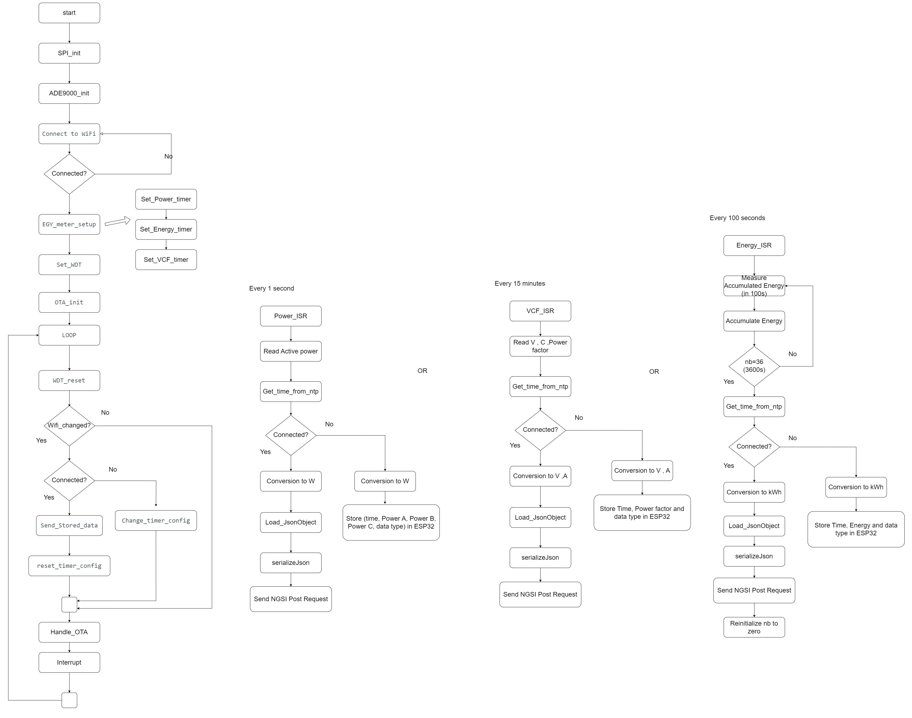
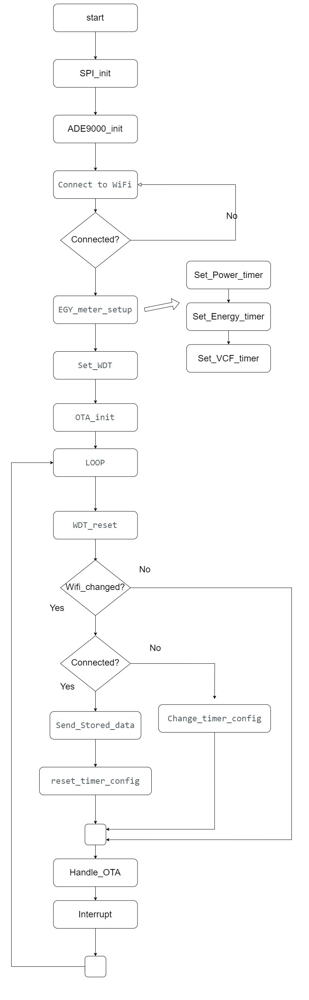
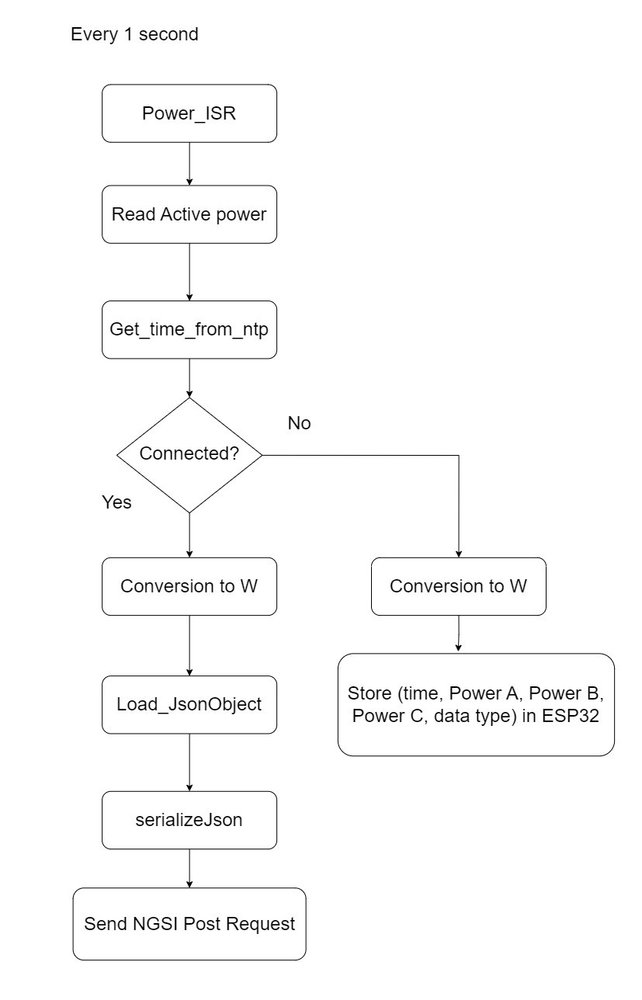

# Project Description

## Introduction:
The Three phases Energy analyse and monitor is project that aims to accurately measure and present the digital twin representation of power quantity and quality in three-phase systems. This system leverages the ADE9000 integrated circuit for precise measurements. The data is then transmitted via the ISP interface to an ESP8266, which communicates over Wi-Fi with a FIWARE context broker. The FIWARE context broker is responsible for data storage and communication with Grafana for visualization.

## Project Objectives:
L'objectif central de notre projet est de développer un système de smart metering qui permettra la mesure précise et complète des valeurs quantitatives et qualitatives associées aux systèmes de production et de consommation d'énergie électrique. Contrairement à la focalisation sur le ADE 9000, notre attention est portée sur la création d'un outil innovant et performant qui répondra aux besoins spécifiques liés à la surveillance et à l'optimisation des processus énergétiques.

## Systèmes monitorés:

Le système axé sur la mesure et la surveillance de l'énergie en trois phases, pourrait être utilisé pour surveiller divers systèmes de production et de consommation d'énergie électrique. Voici quelques exemples de systèmes que le système peut monitorer :

1. Réseau Électrique Local : Le système pourrait être utilisé pour surveiller la consommation d'énergie dans un bâtiment, permettant aux utilisateurs de prendre des décisions informées pour économiser de l'énergie.
Le système pourrait surveiller la consommation d'énergie pour l'éclairage, le chauffage, la climatisation, etc., afin d'optimiser l'efficacité énergétique.

2. Systèmes d'Énergie Renouvelable : Il pourrait être utilisé pour surveiller les systèmes de production d'énergie renouvelable tels que les parcs éoliens, les centrales solaires, etc.

# Architecture

# Système embarqué

L'ESP32 effectue des mesures périodiques via des interruptions de timer. Les données sont transmises par Wi-Fi, et en cas d'interruption de la connexion, l'ESP32 stocke les informations dans une mémoire limitée de 512 octets. Elle surveille activement la connexion Wi-Fi, ajustant les timers pour minimiser le stockage local si la connexion est interrompue. Cette approche garantit une gestion efficace des données malgré les perturbations de la connectivité

## Schema
...
## code
...
# NGSI / datamodeles 
Les données qu’on va utiliser sont :
• activeEnergyExport : Energie active exportée par phase depuis la date de début du comptage.

• activeEnergyImport : Énergie active importée consommée par phase depuis la date de début du comptage.

• activePower : Puissance active consommée par phase depuis la date de début du comptage.

• courant : 'Courant électrique.

• dateEnergyMeteringStarted : date de début du comptage de l'énergie.

• dateModified : Horodatage de la dernière modification de l'entité.

• phaseToPhaseVoltage : 'Tension entre phases.

• Facteur de puissance :

• refTargetDevice : appareil(s) pour lequel(s) la mesure a été effectuée

Les requétes  d’ectriture des systèmes IoT correspondant au NGSI sont trouvés dans le fichier  suivant : https://github.com/FiwareAtSupCom/3P_nrj_monitor/blob/main/REQUETE.txt 

la structure commune au sein de chaque entité de données doit être standardisée afin de favoriser la réutilisation.
Le modèle de données se trouve dans le fichier suivant : https://github.com/FiwareAtSupCom/3P_nrj_monitor/blob/main/data-model.txt

Le digital twin serait constamment mis à jour en temps réel à partir des données provenant de l’ESP. Il refléterait les fluctuations de la puissance consoméé. Pour permettre une interation facile, le digital twin aurait une interface utilisateur graphique qui fournirait des visualisations intuitives et des graphiques de performance.
# Base de données et registers
....
# Front End / Grafana ?
.....

