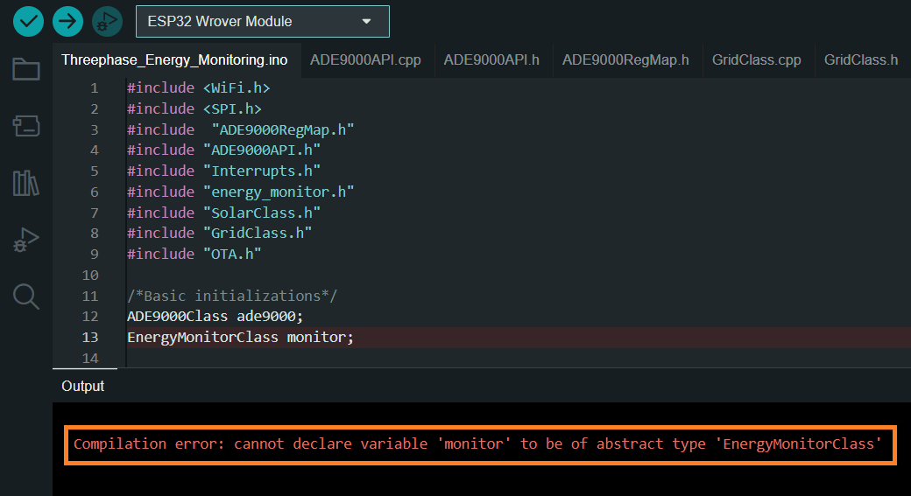
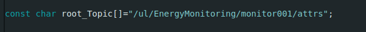

# Project Description

## Introduction:
The Three phases Energy analyse and monitor is project that aims to accurately measure and present the digital twin representation of power quantity and quality in three-phase systems. This system leverages the ADE9000 integrated circuit for precise measurements. The data is then transmitted via the ISP interface to an ESP8266, which communicates over Wi-Fi with a FIWARE context broker. The FIWARE context broker is responsible for data storage and communication with Grafana for visualization.

## Project Objectives:
The central objective of our project is to develop a smart metering system that enables precise and comprehensive measurement of quantitative and qualitative values associated with electric energy production and consumption systems. Unlike the focus on the ADE 9000, our attention is directed towards creating an innovative and high-performance tool that will meet specific needs related to monitoring and optimizing energy processes.
## Three Phase Power:
Three-phase power involves three interconnected voltage sources supplying the same load, offering significant advantages over single-phase or two-phase systems. In three-phase power, the voltage or current waves are 120 degrees apart, ensuring perfect balance when summed together. This balance results in continuous and constant power, leading to smoother operation for three-phase motors compared to single-phase motors.

One key benefit is the elimination of the need for a neutral conductor if the currents balance precisely. This is advantageous for power companies, reducing the number of conductors required in overhead lines. The absence of a neutral conductor also contributes to savings in transformer design, as magnetic fluxes naturally balance.

The primary advantage of three-phase power is evident in motors, where the three-phase currents create a rotating magnetic field, allowing the motor to start rotating without requiring additional mechanisms, such as phase shift capacitors or extra windings needed in single-phase motors.
## Identifying a 3-Phase Supply:
The straightforward method to determine if you have a 3-phase supply is by locating your meter and distribution board/consumer unit. If you have four relatively thick cables, excluding green or green/yellow earth cables, connecting to the meter, with two going to your consumer unit or fuse-board, then you do not have a three-phase supply. Conversely, if you observe eight reasonably thick cables connected to the meter, with four going to your consumer unit or fuse-board, and your main circuit breaker has 3 or 4 sections operated by a single lever – referred to as a 3-pole or 4-pole linked MCB – then you indeed have a three-phase supply.
## Mathematics of a 3-Phase Supply:
When working with a single-phase mains supply and resistive loads, standard mathematics (V = I.R, P = V2 / R, etc.) suffices. However, when dealing with reactive components such as inductors and capacitors, and a graphical representation is needed to visualize the relationships between voltages and currents in different parts of the circuit, we rely on a tool known as a 'phasor.' A phasor is essentially a rotating line with length and direction, where the length represents the magnitude of voltage or current, and the angle signifies its relationship to a chosen reference point.

For a 3-phase supply, we can use three phasors spaced 120° apart to illustrate the relationship between the three voltages. If we were to connect a 3-channel oscilloscope to the supply, the displayed waveform might resemble the following:

  

The phasors rotate in sync with the supply frequency, maintaining a 120° separation between each other, as well as between the corresponding voltage waveforms—forming a complete cycle of 360°.

This depiction highlights a fundamental characteristic of a 3-phase supply. Taking the voltage as the UK standard of 240 V, which is the voltage between one line and neutral, the arrow's length represents this value. The voltage between any two phases is noticeably larger, precisely √3 times larger, as determined by trigonometry—equivalent to the distance between the tips of the arrows. Thus, the line–line voltage measures 415.7 V (commonly denoted as 415 V). Additionally, the line–line voltages exhibit a phase shift of 30° relative to the line–neutral voltages.

For power delivery in a 3-phase system, the power is three times that of a single phase. Assuming unity power factor, this translates to 3 times line-neutral voltage times line current or √3 times line-line voltage times line current.

The diagram, originally depicting the relationship between the 3 voltages, is not limited to voltages alone; it can also represent currents. Its true value emerges when both voltages and currents are concurrently illustrated.
### Measuring 3-Phase Power with ADE9000:

**Analog Operation of ADE9000:.**

**Measurement of Analog Signals:.** ADE9000 measures electrical signals such as voltage and current in electrical power production and consumption systems.

**Analog-to-Digital Converters (ADC):.** Captured analog signals are converted to digital signals using high-resolution integrated Analog-to-Digital Converters (ADC). This ensures high precision in measuring electrical quantities.

**Analog Filtering:.** Analog signals may be susceptible to interference and noise. ADE9000 can incorporate analog filters to eliminate undesirable noise, ensuring reliable measurements.

**Digital Operation of ADE9000:.**

**Digital Signal Processing (DSP):.** Obtained digital signals are processed digitally by a Digital Signal Processor (DSP). The DSP performs complex calculations to derive electrical parameters such as active power, reactive power, power factor, etc.

**Digital Storage:.** Measurement and calculation results are stored digitally, typically in the integrated memory of ADE9000. This data is then ready to be transmitted to other components of the system.

**Digital Communication:.** Data is transmitted via the ISP interface to an ESP8266.

**Operation of ISP:.**

**Data Encoding:.** The data to be transmitted is encoded according to a specific format defined by the ISP protocol. This may include information such as headers, addresses, payload data, and control bits. Encoding ensures a consistent structure for transmission.

**Commands and Responses:.** The ISP protocol defines specific commands that instruct the receiver (in this case, the ESP8266) on actions to take. For instance, there might be a command to request data transmission, another to indicate the end of transmission, etc. Responses confirm the successful reception of commands.

**Serial Transmission:.** Most ISP protocols use serial transmission to send data from one component to another. This means that data is sent one bit at a time over a dedicated communication line.

**Clock Management:.** Some ISP protocols may use a shared clock between the transmitter and receiver to synchronize transmission. This ensures that bits are read and written at the correct timing.

**Checksum or CRC:.** To ensure data integrity, the ISP protocol may include a checksum or cyclic redundancy check (CRC). This allows the receiver to verify if the data has been transmitted correctly.

**Start and Stop Bits:.** The transmitted data may be framed by start bits and stop bits, defining the beginning and end of each data byte.

## Monitoring System:
The three-phase energy measurement and monitoring system could be utilized to monitor various electric energy production and consumption systems. Here are some examples of systems that the system can monitor:

1. Local Electrical Grid: The system could be used to monitor energy consumption in a building, enabling users to make informed decisions to save energy. It could monitor energy consumption for lighting, heating, air conditioning, etc., to optimize energy efficiency.

2. Renewable Energy Systems: It could be employed to monitor renewable energy production systems such as wind farms, solar power plants, etc.

# Architecture
### Functional & description

1. ADE9000 Electrical Parameter Acquisition:
The ADE9000 meter captures electrical parameters and stores them in its registers.

2.  ESP32 Data Retrieval via SPI Interface:
The ESP32 reads data from the ADE9000 using the SPI interface.

3.  Data Transmission using Wi-Fi and HTTP Requests:
The ESP32 transmits data through HTTP requests over Wi-Fi, facilitating seamless communication.

4.   Orchestrating Data with Context Broker:
The Context Broker, acting as the data orchestrator, receives data from ESP32 and stores it in MongoDB for digital twin creation.

5.  Time Series Database with Quantum Leap and CrateDB:
Quantum Leap ensures data continuity by transferring information from MongoDB to CrateDB, establishing a robust time series database.

6.  Visualization with Grafana:
Grafana, interfacing with CrateDB, provides an intuitive and real-time visualization platform for effective analysis and monitoring of the energy system.
### Information system & description

1. Data Flow Overview for IoT Energy Monitoring System:
In our project, the data flow initiation involves the IoT device sending NGSI V2 requests to the Orion Context Broker. Subsequently, the Context Broker stores this data in MongoDB, establishing a robust foundation for the creation of digital twins, virtual instances that faithfully mirror the real-time states of corresponding physical systems.

2. Quantum Leap to CrateDB Integration:
Simultaneously, Orion Context Broker extends its data recording to CrateDB through Quantum Leap. This process ensures the backup of information in a highly performant database, ensuring data availability for in-depth analyses.

3. Grafana Visualization via CrateDB:
To intuitively visualize this data, we employ Grafana, which connects to CrateDB to extract the necessary information. This integration facilitates real-time visualization and provides powerful tools for the analysis and comprehension of the performance of monitored energy systems. Thus, our comprehensive architecture ensures efficient data collection, storage, and intelligent visualization, contributing to optimal management of energy processes.
# Embedded System

The ESP32 performs periodic measurements using timer interrupts. The data is transmitted over Wi-Fi using MQTT protocol, and in case of a connection interruption, the ESP32 stores the information and the timestamp. It actively monitors the Wi-Fi connection, adjusting timers to minimize local storage if the connection is disrupted. This approach ensures efficient data management despite connectivity disruptions.


## Schema


## Prerequisites
- Install Arduino IDE:
[Arduino IDE](https://www.arduino.cc/en/software)

- Install ESP32 Board in Arduino IDE:
[ESP32 Board](https://www.instructables.com/Installing-the-ESP32-Board-in-Arduino-IDE-Windows-/)

- Install libraries:(ArduinoMQTTClient and ESP32Time)


## code

### Project files

- `Threephase_Energy_Monitoring.ino`:

- `defined.h`:

- `ADE9000RegMap.h`:

- `ADE9000API.cpp`:

- `ADE9000API.h`:

- `energy_monitor.cpp`:

- `energy_monitor.h`:

- `GridClass.cpp`:

- `GridClass.h`:

- `SolarClass.cpp`:

- `SolarClass.cpp`:

- `Interrupts.cpp`:

- `Interrupts.h`:

- `RealTime.cpp`:

- `RealTime.h`:

- `OTA.cpp`:

- `OTA.h`:

### Classes

- The "EnergyMonitor" abstract class forms the core structure, defining essential attributes and methods for comprehensive energy tracking. This abstraction lays the groundwork for specialized monitoring through two derived classes: "SolarClass" and "GridClass," both inheriting from "EnergyMonitor." In these subclasses, the methods for calculating "totalActiveEnergy" and "totalReactiveEnergy" are redefined to cater specifically to solar and grid-based energy sources. 


### Explanation of functions

- `EnergyMonitorClass`:Constructor of EnergyMonitorClass.

- `handleWifiStatus`:Maintain Wifi connection. 

- `checkBroker`:Maintain connection with the broker.

- `InitEnergyCounter`:

- `StoreCountedEnergy`:Store the active energy of each phase in EEPROM.

- `ReadEnergyCounter`: Read the total stored Energy of a selected phase.

- `store_data`: In case of wifi disruption, it stores measurements with timestamp in a queue.

- `send_data`: when the connection is restored, it sends the stored data.

- `Change_timers_config`: reconfigure the periodicity of the interrupts.

- `MeasureStartTime`: It stores the first time of measuring in EEPROM, this value is stored only one.

- `energy_meter_setup`: Initialize the monitor.

- `PublishdateObserved`: Publish the timestamp of measurement.

- `PublishphaseType`: Publish the phase type (threephase or singlephase)

- `PublishActivePower`: Publish the active power and the total active power.

- `PublishReactivePower`: Publish the reactive power and the total reactive power.

- `PublishApparentPower`: Publish the apparent power and the total apparent power.

- `PublishpowerFactor`: Publish power factor.

- `PublishdisplacementpowerFactor`: Publish displacement power factor.

- `Publishvoltage`: Publish voltage.

- `Publishcurrent`: Publish current.

- `PublishvoltagePhaseToPhase`: Publish Line voltage.

- `Publishfrequency`: Publish frequency.

- `PublishvoltageTHD`:Publish voltage distorsion.

- `PublishcurrentTHD`: Publish current distorsion.

- `SolarClass`:Constructor of SolarClass.

- `GridClass`:Constructor of GridClass.

- `PublishtotalActiveEnergy`: Publish total Imported active energy of a Grid system or Publish total Exported active energy of a Solar system.

- `PublishtotalReactiveEnergy`: Publish total Imported reactive energy of a Grid system or Publish total Exported reactive energy of a Solar system.

- Inside Handlewifi function:


## Monitor configuration

- Set-up Wifi credentials. 
Use ipconfig(for windows) or ifconfig(for linux) to get your ip address that represents the broker address.


- You can configure the periodicity of measurements using the defined parameters.


- You can configure timerFactorChanger to make less measurements in case of wifi disruption.


- Choosing between Grid or solar class is simple, you should only redeclare the monitor object as GridClass member or SolarClass member.


- Be careful, you should not use the EnergyMonitorClass because it is an abstract class.



- Set the features of the device like (Type, phaseType, deviceID, deviceName....)


- Set the root topic (defined in energy_monitor.cpp) using "ul" (ultra light protocol) , "EnergyMonitoring" (API_KEY) and design topics using the features of the device (in defined.h)




# Prerequisites
## Docker and Docker Compose

For simplicity, all components will be executed using [Docker](https://www.docker.com), a container technology that facilitates the isolation of different components within their respective environments.
 - To set up Docker on Windows, refer to the provided instructions [here](https://docs.docker.com/docker-for-windows/).
 - For Mac users, the installation steps for Docker can be found[here](https://docs.docker.com/docker-for-mac/).
 - Linux users can install Docker by following the instructions available [here](https://docs.docker.com/install/).
 Docker Compose, a tool designed for defining and running multi-container Docker applications, utilizes [YAML files](https://raw.githubusercontent.com/Fiware/tutorials.Time-Series-Data/master/docker-compose.yml)files to configure the necessary services for the application. This approach allows for the simultaneous launch of all container services with a single command. While Docker Compose comes pre-installed with Docker for Windows and Docker for Mac, Linux users may need to refer to the instructions provided [here](https://docs.docker.com/compose/install/) for installation.
 You can check your current **Docker** and **Docker Compose** versions using the following commands:


```console
docker-compose -v
docker version
```
It is required to have a version of Docker Compose equal to or greater than 3 for this project.
# Start Up
1. ### Wi-Fi Network Setup:
Ensure your Wi-Fi network is properly configured for connectivity between devices. This is crucial for seamless data transmission.

2. ### Context Broker (Orion):
The FIWARE Orion Context Broker serves as the central hub for managing context data in our IoT system. It receives requests using the NGSI-v2 standard and handles crucial aspects such as data entities, subscriptions, and registrations.
### Configuration:
```yaml
orion:
    image: quay.io/fiware/orion:latest
    hostname: orion
    container_name: orion
    depends_on:
        - mongo-db
    networks:
        - default
    expose:
        - '1026'
    ports:
        - '1026:1026'
    command: -dbhost mongo-db -logLevel DEBUG
```
3. ### MongoDB
MongoDB is employed as the backend for the Orion Context Broker. It plays a pivotal role in storing context data information, managing data entities, and facilitating various operations related to context management.
### configuration:
```yaml
mongo-db:
    image: mongo:4.2
    hostname: mongo-db
    container_name: db-mongo
    expose:
        - '27017'
    ports:
        - '27017:27017'
    networks:
        - default
```
4. ### QuantumLeap Configuration
FIWARE QuantumLeap is a powerful generic enabler designed to simplify the storage and retrieval of time-series data generated by the Orion Context Broker. Unlike the STH-Comet generic enabler, QuantumLeap seamlessly integrates with time-series databases, offering compatibility with databases like CrateDB and TimescaleDB.
### configuration:
```yaml
quantumleap:
    image: smartsdk/quantumleap
    hostname: quantumleap
    ports:
        - '8668:8668'
    depends_on:
        - crate-db
    environment:
        - CRATE_HOST=crate-db
    networks:
      - fiware_network
```
The quantumleap container is listening on one port:

The Operations for port for QuantumLeap - 8668 is where the service will be listening for notifications from the Orion context broker and where users can query data from.
The CRATE_HOST environment variable defines the location where the data will be persisted.

5. ###  Connecting FIWARE to CrateDB via QuantumLeap

In the configuration, QuantumLeap listens to NGSI v2 notifications on port 8668 and persists historic context data to CrateDB. CrateDB is accessible using port 4200 and can either be queried directly or attached to the Grafana analytics tool.

6. ### CrateDB Database Server Configuration

CrateDB serves as a dedicated data sink for our IoT system, with a specific focus on handling time-based historical context data. As a distributed SQL database system tailored for IoT applications, CrateDB excels in ingesting a high volume of data points per second and supports real-time querying. Its capabilities make it well-suited for handling complex queries involving geospatial and time-series data.
#### Analyzing time series data
Analyzing time series data is crucial for effectively monitoring the three-phase electricity system. The suitability of time series data analysis hinges on the specific requirements of your project and the reliability of the collected measurements. This analytical approach enables you to address key questions related to the electricity system, such as determining the maximum, average, and cumulative measurements of the devices over specific time intervals. Additionally, time series analysis can be applied to mitigate the impact of outliers by employing smoothing techniques, thereby enhancing the overall robustness of the monitoring process.

To set up the CrateDB Database Server, use the following configuration in your docker-compose.yml file:

```yaml
crate-db:
    image: crate:4.1.4
    hostname: crate-db
    ports:
        - '4200:4200'
        - '4300:4300'
    command:
        crate -Clicense.enterprise=false -Cauth.host_based.enabled=false  -Ccluster.name=democluster
        -Chttp.cors.enabled=true -Chttp.cors.allow-origin="*"
    environment:
        - CRATE_HEAP_SIZE=2g
```
If CrateDB exits immediately with a max virtual memory areas vm.max_map_count [65530] is too low, increase to at least [262144] error, this can be fixed by running the sudo sysctl -w vm.max_map_count=262144 command on the host machine. 

The cratedb container is listening on two ports:

The Admin UI is available on port 4200
The transport protocol is available on port 4300 


After configuring the docker-compose file, execute it using the following command:
```console 
docker-compose up -d
```

# NGSI / datamodeles 
The Data Model intended to measure the electrical energies consumed by an electrical system which uses an Alternating Current (AC) for a three-phase (L1, L2, L3) or single-phase (L) and neutral (N). It integrates the initial version of the data Modem [THREEPHASEMEASUREMENT], extended to also perform single-phase measurements. It includes attributes for various electrical measurements 

The data we will use is:


* totalActiveEnergyImport:Total energy imported i.e. consumed. The unit code (text) is given using the [UN/CEFACT Common Codes](http://wiki.goodrelations-vocabulary.org/Documentation/UN/CEFACT_Common_Codes). Units:'kilowatt hour'

* totalReactiveEnergyImport:Total energy imported i.e. consumed (with regards to fundamental frequency reactive power). The unit code (text) is given using the [UN/CEFACT Common Codes](http://wiki.goodrelations-vocabulary.org/Documentation/UN/CEFACT_Common_Codes). Units:'kilovolt-ampere-reactive-hour.'

* totalActiveEnergyExport: Total energy imported i.e. consumed . The unit code (text) is given using the [UN/CEFACT Common Codes](http://wiki.goodrelations-vocabulary.org/Documentation/UN/CEFACT_Common_Codes). Units:'kilowatt hour'

* totalReactiveEnergyExport:  Total fundamental frequency reactive energy exported. The unit code (text) is given using the [UN/CEFACT Common Codes](http://wiki.goodrelations-vocabulary.org/Documentation/UN/CEFACT_Common_Codes). Units:'kilovolt-ampere-reactive-hour'
  
* dateObserved: Date and time of this observation represented by an ISO8601 UTC format. It can be represented by an specific time instant or by an ISO8601 interval to separate attributes `dateObservedFrom`,`dateObservedTo`
  
* refDevice: Reference to the devices which captured this observation. Model:'https://schema.org/URL'
  
* frequency: The frequency of the circuit. The unit code (text) is given using the [UN/CEFACT Common Codes](http://wiki.goodrelations-vocabulary.org/Documentation/UN/CEFACT_Common_Codes). Units:'Hertz'
  
* phaseType: Type of Phase. A unique value. Enum:'singlePhase, threePhase'
  
* "phaseVoltage: The voltage between each phase and neutral conductor. The unit code (text) is given using the [UN/CEFACT Common Codes](http://wiki.goodrelations-vocabulary.org/Documentation/UN/CEFACT_Common_Codes). Units:'Volts'
  
* phaseToPhaseVoltage: Voltage between phases. The unit code (text) is given using the [UN/CEFACT Common Codes](http://wiki.goodrelations-vocabulary.org/Documentation/UN/CEFACT_Common_Codes). Units:'Volts'
  
* thdVoltage: Total harmonic distortion of voltage for each phase
  
* thdCurrent: Total harmonic distortion of current for each phase

* activePower: Active power consumed per phase. The unit code (text) is given using the [UN/CEFACT Common Codes](http://wiki.goodrelations-vocabulary.org/Documentation/UN/CEFACT_Common_Codes). Units:'Watt'

* reactivePower: Fundamental frequency reactive power. The unit code (text) is given using the [UN/CEFACT Common Codes](http://wiki.goodrelations-vocabulary.org/Documentation/UN/CEFACT_Common_Codes). Units:'volts-ampere-reactive'

* apparentPower: Apparent power consumed per phase. The unit code (text) is given using the [UN/CEFACT Common Codes](http://wiki.goodrelations-vocabulary.org/Documentation/UN/CEFACT_Common_Codes). Units:'Watt'

* totalActivePower: Total Active Power consumed. The unit code (text) is given using the [UN/CEFACT Common Codes](http://wiki.goodrelations-vocabulary.org/Documentation/UN/CEFACT_Common_Codes). Units:'Watt'

* totalReactivePower: Total Reactive Power consumed. The unit code (text) is given using the [UN/CEFACT Common Codes](http://wiki.goodrelations-vocabulary.org/Documentation/UN/CEFACT_Common_Codes). Units:'volt-ampere-reactive'

* totalReactivePower: Total Reactive Power consumed. The unit code (text) is given using the [UN/CEFACT Common Codes](http://wiki.goodrelations-vocabulary.org/Documentation/UN/CEFACT_Common_Codes). Units:'volt-ampere-reactive'

* current: Electrical current. The unit code (text) is given using the [UN/CEFACT Common Codes](http://wiki.goodrelations-vocabulary.org/Documentation/UN/CEFACT_Common_Codes). Units:'Ampere'

* dateEnergyMeteringStarted: start date of energy metering.

* dateModified: Timestamp of the last modification of the entity.


* Power factor :  It is the ratio of real power (the power that actually performs the work) to apparent power (the total power in the circuit).


The requests for writing IoT systems corresponding to the NGSI are found in the following files: 

https://github.com/FiwareAtSupCom/3P_nrj_monitor/blob/main/NGSI%20requests/3%20phases%20POST%20request.txt

https://github.com/FiwareAtSupCom/3P_nrj_monitor/blob/main/NGSI%20requests/solar%20POST%20request.txt

the common structure within each data entity must be standardized to promote reuse.

The data model for threephase measurement can be found in the following file: 
https://github.com/FiwareAtSupCom/3P_nrj_monitor/blob/main/data%20model/schema.json extracted from: https://github.com/smart-data-models/dataModel.Energy/blob/master/ACMeasurement/schema.json

*to add entity to iot agent use the following request:
```yaml
curl -iX POST 'http://localhost:4041/iot/entities' \
  -H 'Content-Type: application/json' \
  -H 'fiware-service: openiot' \
  -H 'fiware-servicepath: /' \
  -d '{
  "devices": [
    {
      "id": "urn:ngsi-ld:ACMeasurement:ACMeasurement:MNCA-ACM-001",
      "type": "ACMeasurement",
      "protocol": "PDI-IoTA-UltraLight",
      "transport": "MQTT",
      "name": "AirPort-NCE-T1-F01-TR05-ACTP",
      "alternateName": "AirPort global Observation",
      "description": "Measurement corresponding to the ventilation machine of the technical rooms Terminal 1 T1 Floor 01 Technical Room 05 for Triphase alternating current.",
      "location": {
        "type": "Point",
        "coordinates": [
          43.66481,
          7.196545
        ]
      },
      "areaServed": "Nice Aeroport",
      "dateObserved": "2020-03-17T08:45:00Z",
      "refDevice": [
        "urn:ngsi-ld:Device:T1-F01-TR05-ACTP"
      ],
      "phaseType": "threePhase",
      "frequency": 50.020672,
      "dateEnergyMeteringStarted": "2020-07-07T15:05:59.408Z",
      "totalActiveEnergyImport": 150781.96448,
      "totalReactiveEnergyImport": 20490.3392,
      "totalActiveEnergyExport": 1059.80176,
      "totalReactiveEnergyExport": 93275.02176,
      "activePower": {
        "L1": 11996.416016,
        "L2": 9461.501953,
        "L3": 10242.351562
      },
      "reactivePower": {
        "L1": -2612.606934,
        "L2": -2209.906006,
        "L3": -3007.81958
      },
      "apparentPower": {
        "L1": 13201.412109,
        "L2": 10755.304688,
        "L3": 11941.094727
      },
      "totalActivePower": 31700.269531,
      "totalReactivePower": -7830.332031,
      "totalApparentPower": 36019.089844,
      "powerFactor": {
        "L1": 0.908817,
        "L2": 0.879906,
        "L3": 0.859293
      },
      "displacementPowerFactor": {
        "L1": 0.978013,
        "L2": 0.973317,
        "L3": 0.960382
      },
      "current": {
        "L1": 56.126038,
        "L2": 45.894356,
        "L3": 50.872452,
        "N": 0.0
      },
      "phaseVoltage": {
        "L1": 234.961304,
        "L2": 234.563477,
        "L3": 235.354034
      },
      "phaseToPhaseVoltage": {
        "L12": 406.769196,
        "L23": 407.081238,
        "L31": 407.734558
      },
      "thdVoltage": {
        "L1": 0.01471114,
        "L2": 0.01600046,
        "L3": 0.01541459
      },
      "thdCurrent": {
        "L1": 0.38497337,
        "L2": 0.45807529,
        "L3": 0.4938652
      }
    }
  ]
}'
```
*to show the added device :
```yaml
curl -X GET \
  'http://localhost:4041/iot/devices' \
  -H 'fiware-service: openiot' \
  -H 'fiware-servicepath: /'
```
*to show the addes device from the context broker:
```yaml
curl -X GET \
  'http://localhost:1026/v2/entities/urn:ngsi-ld:ACMeasurement:ACMeasurement:MNCA-ACM-001?type=ACMeasurement' \
  -H 'fiware-service: openiot' \
  -H 'fiware-servicepath: /'
```
*to add subscription to the context broker :
```yaml
curl -iX POST 'http://localhost:1026/v2/subscriptions' \
  -H 'Content-Type: application/json' \
  -H 'fiware-service: openiot' \
  -H 'fiware-servicepath: /' \
  -d '{
  "description": "Notify QuantumLeap of all DHT Sensor changes",
  "subject": {
    "entities": [
      {
        "idPattern": "urn:ngsi-ld:ACMeasurement:ACMeasurement:MNCA-ACM-001"
      }
    ]
  },
  "notification": {
    "http": {
      "url": "http://quantumleap:8668/v2/notify"
    }
  }
}'
```
*to show the created subscription:
```yaml
curl -X GET \
  'http://localhost:1026/v2/entities/subscriptions' \
  -H 'fiware-service: openiot' \
  -H 'fiware-servicepath: /'
```
The digital twin would be constantly updated in real time using data from the ESP. It would reflect fluctuations in power consumed. To enable easy interaction, the digital twin would have a graphical user interface that would provide intuitive visualizations and performance charts.

## Front End / Grafana ?
The choice of technology to use:


• Ease of Use and Flexibility: Grafana provides a user-friendly interface for creating visualizations and dashboards without extensive coding. Its flexibility allows easy integration with various data sources, including CrateDB and Fiware solutions, making it a versatile choice.

• Real-Time Data Visualization: Grafana supports real-time data visualization, allowing you to create live dashboards that update dynamically as new data comes in. This is crucial for monitoring grid systems that require up-to-date information.

• Large Variety of Visualization Options: Grafana offers a wide array of visualization options. This variety enables you to choose the most suitable visualization type for different types of grid system data.

• Alerting and Monitoring Capabilities: Grafana provides alerting functionalities that can be set up based on the data from CrateDB and Fiware, allowing for proactive monitoring of the grid systems. This ensures timely responses to any anomalies or critical situations.

• Community Support and Integration: Grafana has a large community of users and developers, resulting in extensive documentation, plugins, and support. It integrates well with various data sources, making it easier to combine data from CrateDB and Fiware in a unified dashboard.

• Using a native frontend or other solutions might be more time-consuming and may lack the robustness and features that Grafana offers specifically for data visualization and monitoring. 


Grafana, in this context, appears to be a strong choice due to its ease of use, real-time capabilities, extensive visualization options, and community support, allowing you to focus more on the representation and analysis of the data rather than the complexities of building a visualization platform from scratch.

• Navigate to http://192.168.33.69:3000 and log in with default credentials which are: admin / admin

• Add a new data source using the following parameters:


• Import the dashboard located in: grafana_dashboard folder:


• The final result should look like this:


• list of views and descriptions:
- 1st view composed from the graph of power (kw) over the last 24h, the actual value of power (kw) and the day of measurement.
- 2nd view represent a bill, it composed from the Todays usage, todays price, monthly use , months price.
- 3rd view the graph of the daily electricity consumption and the daily electricity production.
- 4th view represent the localisation of the AD9000 device in a map.

  

  

  

The mobile application:


